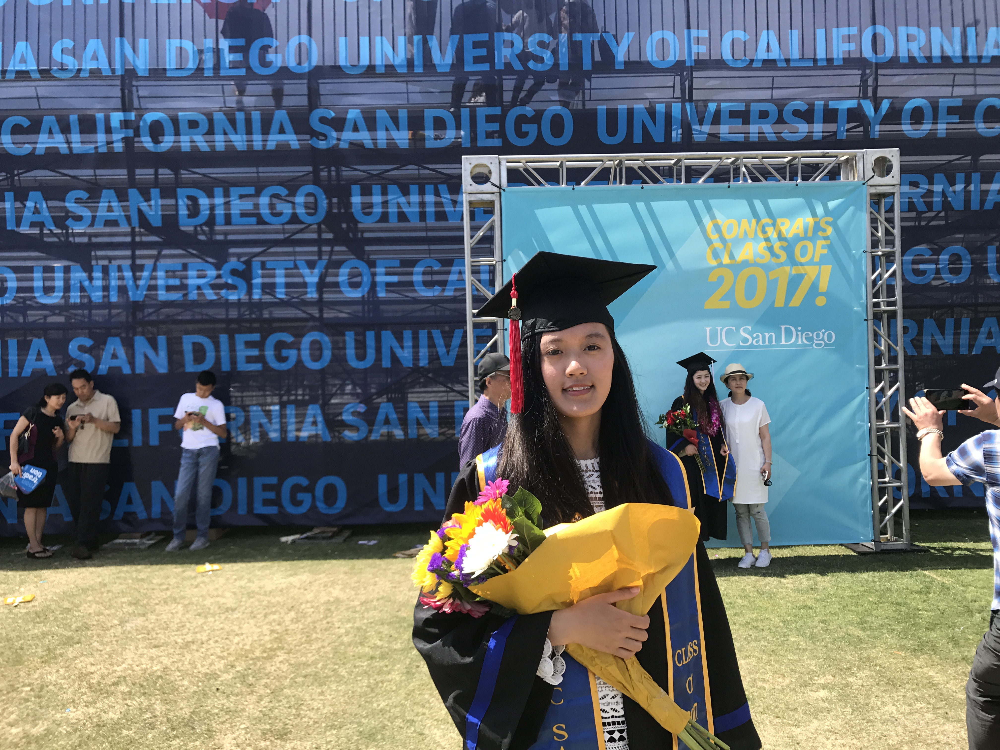

#### _MS candidate in Biostatistics, Columbia University Mailman School of Public Health_

\  
\  
\  

### Welcome!  
  
My name is Shengnan Sun. I am from Qingdao, China, a beautiful coastal city, famous for its delicious seafood and beer. I am currently living in New York, and study biostatistics at Columbia University. 

\  
\  
\  

\  
\  
\  

#### About this site
This is the peronal website of Shengnan Sun. It is built with R, and is hosted from github. The source code can be found [here](https://github.com/shengnans1105/shengnans1105.github.io).

